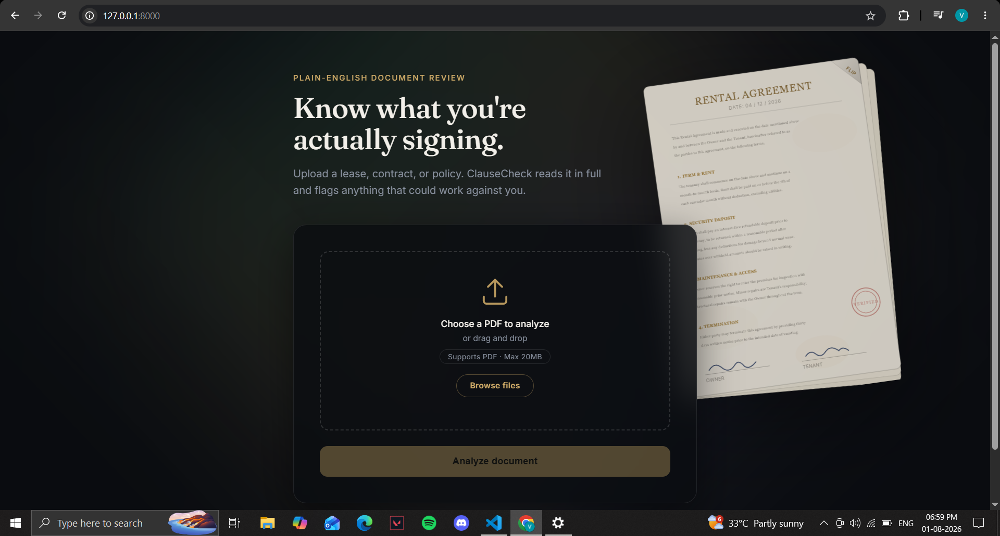
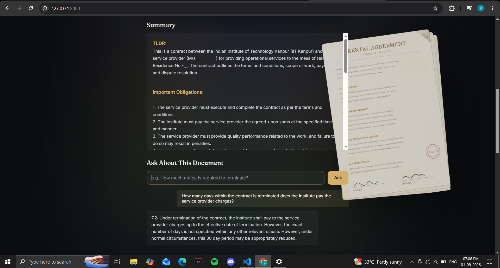
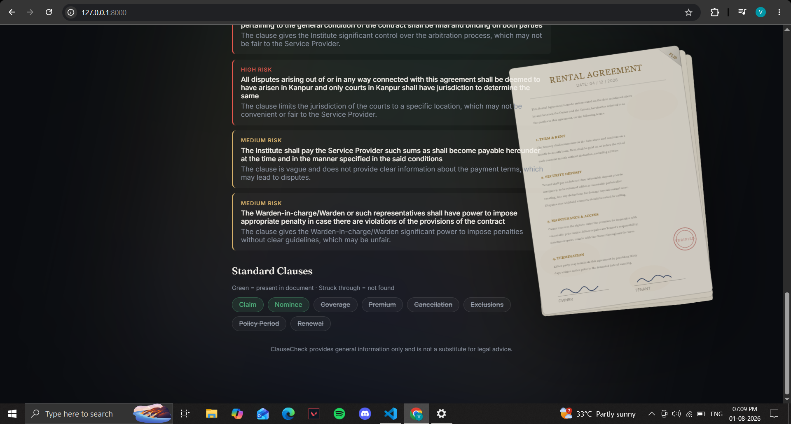

# ClauseCheck

Understand what you're signing. ClauseCheck uses AI to turn confusing contracts, leases, and insurance policies into plain-English summaries, flags risky clauses, checks for standard terms, and lets you ask questions directly about your document.

## Screenshots

**Home screen**


**AI-generated risk flags**


**Summary and Q&A**


**Standard clause comparison**


## Features

- **Plain-English Summary** — TL;DR, obligations, dates, costs, and conditions, extracted automatically from any legal document
- **Risk Flagging** — AI-detected risky or one-sided clauses, rated by severity (high/medium/low) with a plain-English reason for each
- **Standard Clause Comparison** — checks the document against a list of standard clauses and shows what's present vs. missing
- **Ask About This Document** — a RAG-powered Q&A chat that answers natural-language questions grounded only in the uploaded document
- **Interactive UI** — dark, document-themed interface with an animated scanning effect and a flippable ambient document illustration

## Tech Stack

- **Backend:** FastAPI (Python)
- **AI:** Groq API (`llama-3.1-8b-instant`) for summarization, risk detection, and Q&A
- **PDF Parsing:** PyMuPDF
- **Embeddings & Retrieval:** `sentence-transformers` (`all-MiniLM-L6-v2`) + ChromaDB for the Q&A feature
- **Frontend:** Plain HTML, CSS, JavaScript (no build tools)
- **Serving:** FastAPI serves both the API and the static frontend from a single process

## Project Structure

```
ClauseCheck/
├── backend/
│   ├── main.py              FastAPI app — all routes
│   ├── summarizer.py        AI-generated plain-English summary
│   ├── risk_detector.py     AI-generated risk flags (severity + reason)
│   ├── clause_comparator.py Standard clause found/missing check
│   ├── chunker.py           Splits document text into overlapping chunks
│   ├── embeddings.py        Generates embeddings for chunks/questions
│   ├── vector_store.py      ChromaDB storage + similarity search
│   ├── rag.py                Answers questions using retrieved chunks
│   ├── services/
│   │   └── parser.py        Extracts text from uploaded PDFs
│   └── requirements.txt
└── frontend/
    └── index.html            Single-page UI (upload, summary, risk, clauses, Q&A)
```

## API Endpoints

| Method | Path          | Description                                         |
|--------|---------------|------------------------------------------------------|
| GET    | `/api/status` | Health check                                          |
| POST   | `/analyze`    | Upload a PDF → returns text, summary, risk flags, clause comparison, and indexes the document for Q&A |
| POST   | `/ask`        | Ask a question (form field: `question`) about the most recently analyzed document |

## Getting Started

### Prerequisites
- Python 3.10+
- A free [Groq API key](https://console.groq.com)

### Setup
```bash
cd backend
python -m venv venv
source venv/bin/activate       # Windows: venv\Scripts\activate
pip install -r requirements.txt
```

Create a `.env` file inside `backend/`:
```
GROQ_API_KEY=your_actual_key_here
```

### Run
```bash
uvicorn main:app --reload
```
**🔗 Live Demo:** [clausecheck-6vna.onrender.com](https://clausecheck-6vna.onrender.com)

Visit `http://localhost:8000` — this serves the full app (frontend + API together).

## Known Limitations

- **Standard clause list is currently insurance-specific** — the clause comparator checks for terms like Coverage, Premium, and Claim, so it's most useful on insurance policies right now. Generalizing this per document type (lease, loan, NDA, etc.) is a planned improvement.
- **Q&A memory is not persistent** — the vector store used for the "Ask About This Document" feature resets whenever the server restarts, so a document must be re-analyzed before asking questions again after a restart.
- **Large documents are truncated** — to stay within Groq's free-tier rate limits, document text is capped before being sent to the AI, so summaries/risk flags on very long documents may miss later sections.
- **Not legal advice** — ClauseCheck provides general information only and should not be relied on as a substitute for professional legal advice.

## Team

- **Vandit Ahuja** — Frontend, backend integration
- **[Teammate name]** — AI pipeline (summarization, risk detection, RAG/Q&A, clause comparison)

## Roadmap

- [ ] Generalize clause comparator across document types
- [ ] Add error handling for scanned/image-only PDFs
- [ ] Persist vector store data across restarts
- [ ] Deploy live demo